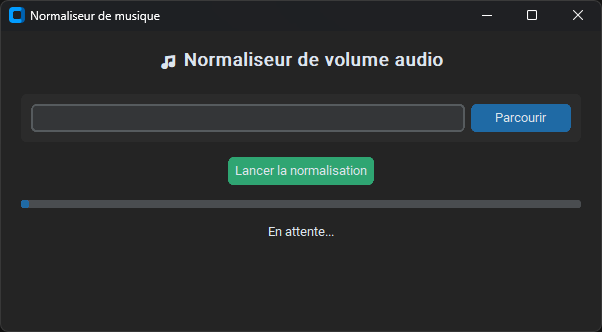

# Guide manual

Team : Théo Pirouelle

<a href="https://www.python.org/">
  
</a>


---

## Installation

> [!NOTE]
> For information, the code has been developed and works on Linux with the following library versions:
> | Library | Version |
> | --- | --- |
> | ffmpeg | 4.4.2 |
> 
> For information, the code has been developed and works on PowerShell with the following library versions:
> | Library | Version |
> | --- | --- |
> | ffmpeg | 2024-03-07 |
> 
> For information, the code has been developed and works on Python with the following library versions:
> | Library | Version |
> | --- | --- |
> | Python | 3.11 |
> | ffmpeg_normalize | 1.36.0 |
> | pytest | 8.4.2 |

To install FFmpeg, you can follow these steps:

- On Windows 10/11:
  - Open a command terminal (`Win+R`, then `cmd`)
  - `winget install ffmpeg`
- On Windows 7/8:
  - Open a PowerShell command window (`Win+R`, then `powershell`)
  - `Set-ExecutionPolicy Bypass -Scope Process -Force; [System.Net.ServicePointManager]::SecurityProtocol = [System.Net.ServicePointManager]::SecurityProtocol -bor 3072; iex ((New-Object System.Net.WebClient).DownloadString('https://community.chocolatey.org/install.ps1'))`
  - `choco install ffmpeg`
- On Linux:
  - Open a command terminal
  - `sudo apt update && sudo apt upgrade`
  - `sudo apt install ffmpeg`

---

## Build

You can build the application using `PyInstaller`.

```bash
pip install pyinstaller

pyinstaller --onefile --noconsole --icon="config\music.ico" --name "NormaliseMusicVolume" src/application.py
```

---

## User manual

### Lightweight script

#### Linux

```bash
> ./normalise.sh [path/to/repository]
```

#### PowerShell

```powershell
> ./normalise.ps1

usage: normalise.ps1 [-SourceDir PATH]

options:
  -SourceDir PATH  Path to the directory to be processed
```

### Executable

Double-click on the executable or use `./application[.exe]` from the command line.

